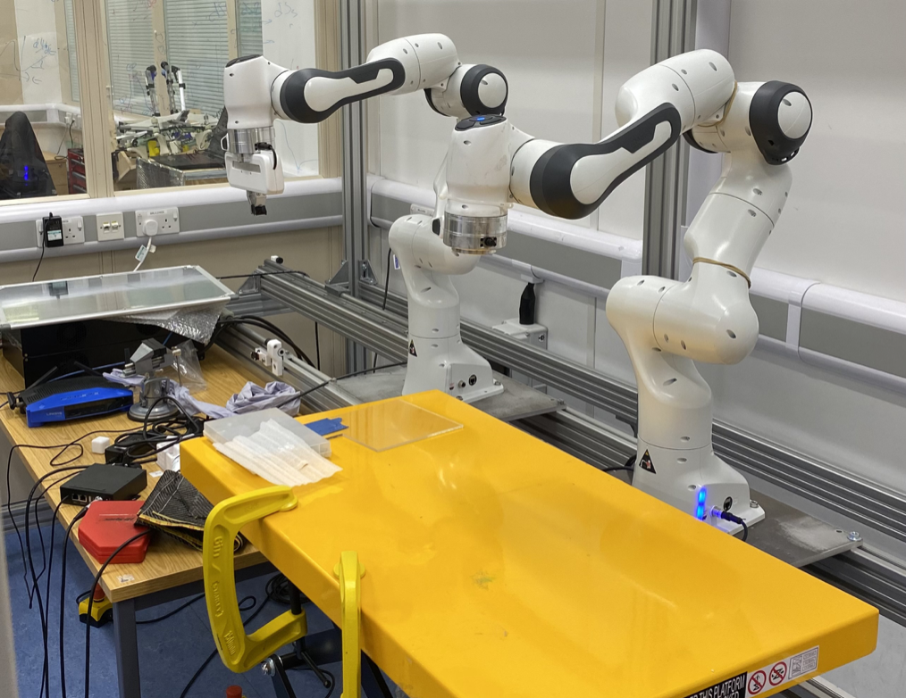

# Project description

• Collaborated with Dr. Zhang on human-robot interaction research to facilitate efficient surgical operation.
• Operated robotic arm trajectory simulations in CoppeliaSim using Python & MATLAB using Learning from
Demonstration (LfD) techniques with an aim to automate monotonous surgical sub-tasks.
• Optimized sim-to-real adaptations to try and translate learned maneuvers from simulation to a physical robot.
• Developed facial recognition via Python’s OpenCV library for remote robot control as a project extension.

## Panda-Franka-Emika robotic arm

