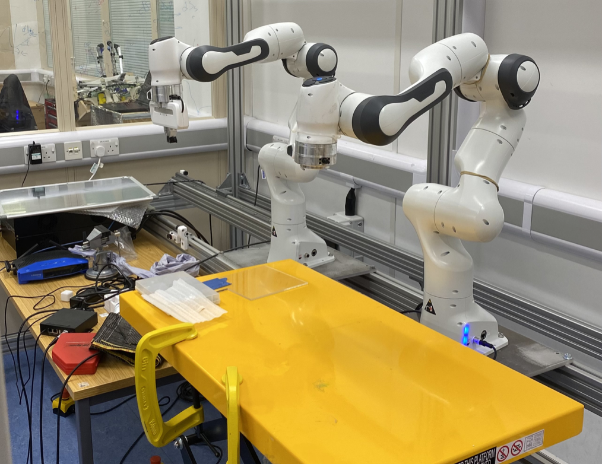

# Human-robot shared control

**A University of Bristol research project driving a Franka Emika Panda arm through simulated trajectories in CoppeliaSim, with an OpenCV face-tracking prototype for remote control.**


Research with Dr. Dandan Zhang on human-robot interaction, aimed at taking repetitive surgical sub-tasks off the operator by teaching a robot arm to do them (Learning from Demonstration). I drove a Franka Emika Panda arm through scripted trajectories in the CoppeliaSim simulator over its remote API, in both Python and MATLAB, and built an OpenCV face-tracking prototype as a route toward controlling the arm remotely.



## What I built

The repository mixes my own scripts with the standard CoppeliaSim remote API, which is kept here so the scripts run as-is. My code is the part that matters:

### `dariancode.py` — arm trajectory control
Connects to a running CoppeliaSim scene through the remote API, gets the Panda end-effector handle, generates a circular/spiral path in the arm's workspace (parametric x and y around a centre, at a fixed height), and drives the end-effector through it point by point with blocking position commands. The section I wrote is marked off inside the connect/disconnect boilerplate.

### `matlab-vrep-v2/darian_code.m` — the same, in MATLAB
The MATLAB version of the trajectory control: fetches the target handle, builds the same circular path, and steps the object through it over the remote API.

### `darianopenCV.py` — face-tracking prototype
Real-time face detection from a webcam using an OpenCV Haar cascade, drawing a box around the detected face. This is the exploratory groundwork for mapping head position to remote arm control rather than a finished controller.

## Provided vs my code

- Mine: `dariancode.py`, `darianopenCV.py`, `matlab-vrep-v2/darian_code.m`.
- Standard CoppeliaSim / V-REP remote API (kept so the examples run, not my work): `sim.py`, `simConst.py`, `simpleTest.py`, `remoteApi.dll`, `remoteApi.dylib`, and the `matlab-vrep-v2/` API files. The `.ttt` files are CoppeliaSim scenes. `readMe.txt` is the API's own setup note.

## Tech stack

Python (`numpy`, OpenCV) · MATLAB · CoppeliaSim / V-REP remote API

## Repository structure

```
Human-Robot-shared-control/
├── docs/
│   └── robot.png              # Franka Emika Panda arm
└── src/
    ├── dariancode.py          # Panda trajectory control (Python)
    ├── darianopenCV.py        # OpenCV face-tracking prototype
    ├── matlab-vrep-v2/
    │   └── darian_code.m      # trajectory control (MATLAB)
    ├── *.ttt                  # CoppeliaSim scenes
    ├── sim.py, simConst.py    # CoppeliaSim remote API (provided)
    └── readMe.txt             # remote API setup note (provided)
```

## Notes

Research project, shared as a portfolio reference. Please don't reuse it as your own academic work.
